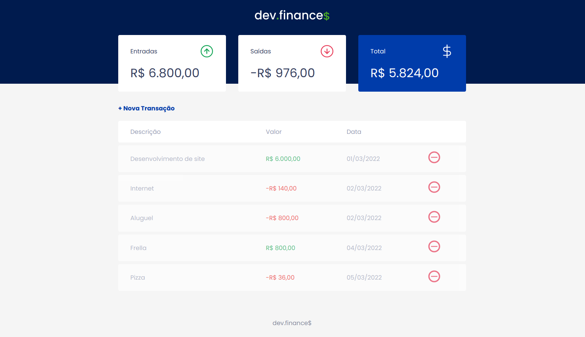

<h1 align="center">
  
</h1>

  <a href="#-technologies">Technologies</a>&nbsp;&nbsp;&nbsp;|&nbsp;&nbsp;&nbsp;
  <a href="#-project">Project</a>&nbsp;&nbsp;&nbsp;|&nbsp;&nbsp;&nbsp;

 

  

 

  

## Site published [here](https://francissverissimo.github.io/dev-finances/)

## 🚀 Technologies
This project was developed with the following technologies:

  
  
  

## 💻 Project

dev.finances is a financial control application, where it is possible to register and delete transactions and see the incoming and outgoing balance 💰

